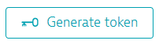
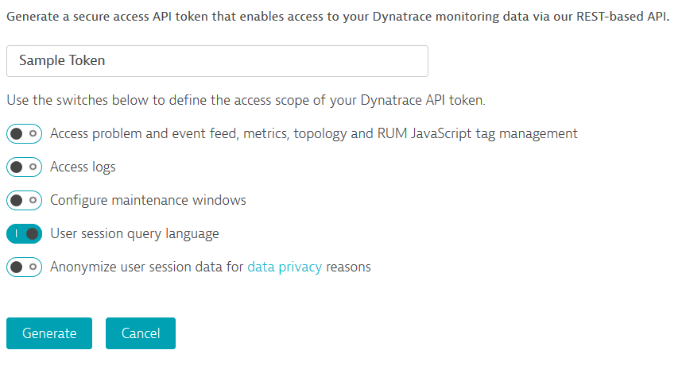
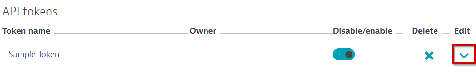
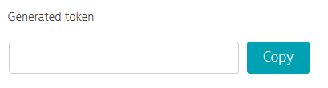
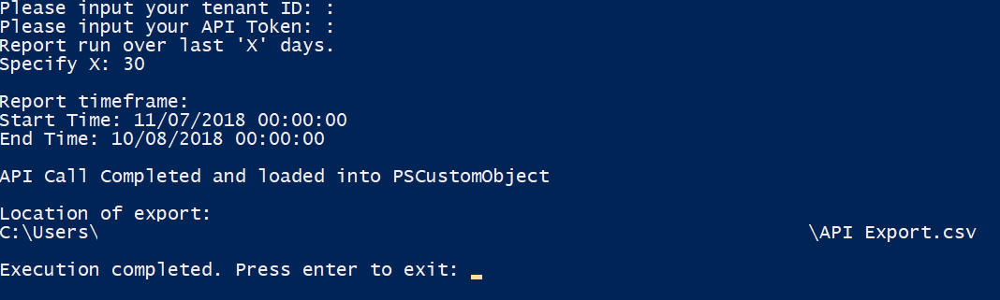

# Updating and running the script

**Note** - This script is intended for once-off runs. For scheduled runs, please edit the time and tenant specific information within the script

## Creating an API Token

**1. Navigate to the API Settings**

`Settings -> Integration -> Dynatrace API`

**2. Click on "Generate token"**

<kbd>
  
</kbd>

**3. Name your token and ensure you have the "User session query language" option enabled. Then click "Generate"**

<kbd>
  
</kbd>
  
**4. Click the drop down arrow for that token**

<kbd>
  
</kbd>

**5. How to copy the Token value**

<kbd>
  
</kbd>

## Running the Script

**1. Right click the script and select `Run with PowerShell`**

**2. Paste your tenant ID in the requested field**

**3. Paste your API Token in the requested field**

**4. Select how many days prior to today you would like the extract taken over**

**5. Press `Enter` to exit the script**

<kbd>
  
</kbd>

